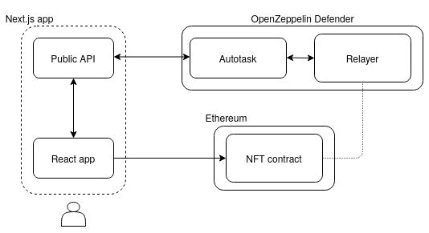
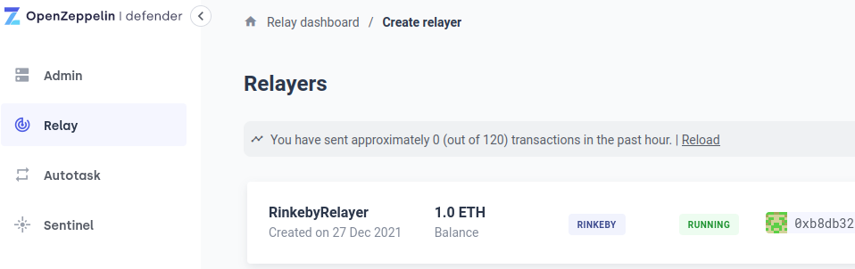
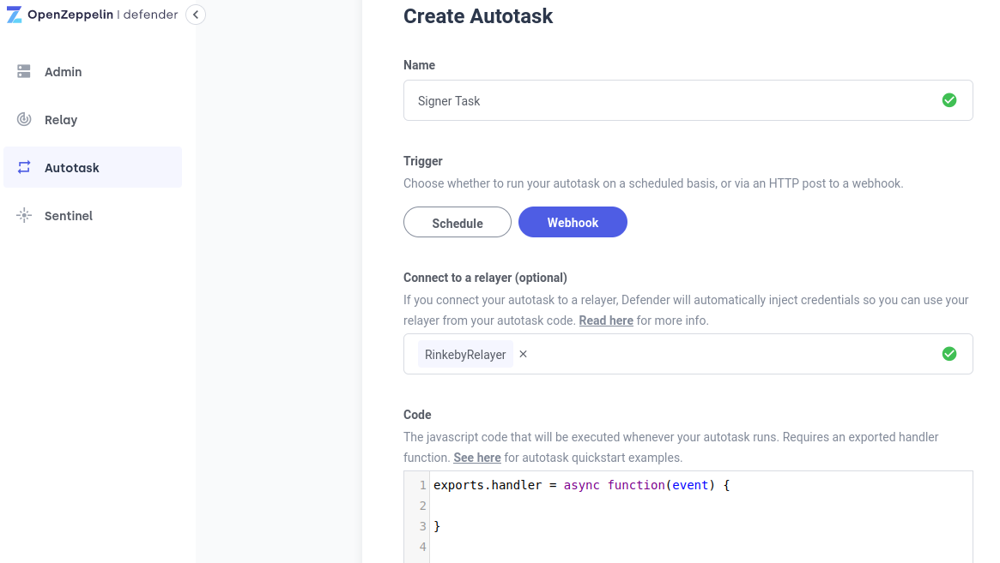
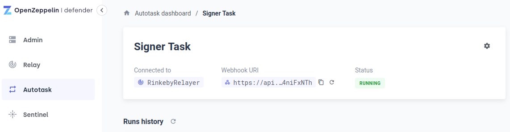
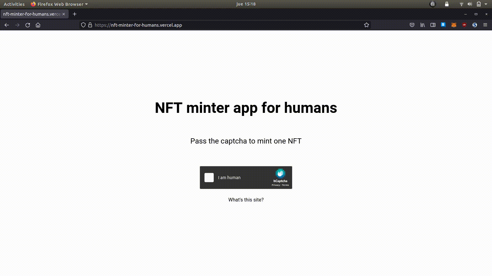

# Human-first NFT mints

_For a more mystic reading experience, replace "bot" or "bot runner" with "dark forest creature"._

Hey folks! Wanted to share a little experiment I coded during this last week. Hoping that it can spark some cool ideas for 2022.

For context, I never coded a production-ready NFT distribution mechanism. But I'm always down to grabbing some popcorn and read aftermath stories of unsuccessful drops from the comfort of my couch.

There I was, reading on a [recent failed NFT drop](https://twitter.com/montana_wong/status/1472023753865396227) (yet another one), which led me to read on some [suggested mitigations](https://twitter.com/Montana_Wong/status/1472302215880527872), which finally led to [this article](https://medium.com/@svswoof/mitigating-gas-wars-bots-and-network-congestion-for-ethereum-nft-projects-6cdba15b91a4). For the lazy ones, essentially it describes some techniques to mitigate adversarial bots that may pose a threat to the entire minting phase of a NFT. 

The ultimate goal being to design more open and fair distributions that simply _cannot_ be ruled by clever bot runners.

In other words, human-first NFT mints.

---

If you're familiar with coding smart contracts, the suggested solution may come across as plainly boring: for a mint operation to succeed, it must include some message signed by an off-chain service. This data is then verified on the smart contract before minting a new NFT.

But (I've been told) life is bigger than smart contracts. And so are our apps and their security.

Therefore, the real challenge is **how to build and wire an entire NFT distribution app so that it can be fully protected from bots**. And when I say app I mean frontend AND the off-chain signing service AND the smart contract(s).

It gets more complicated because teams these days don't have time to setup and maintain bulky backends. There's trouble in building, testing and maintaining them, let alone talk about keeping the signing private keys safe, etc, etc, etc. Too many moving parts.

So I set off to hack something simple and lightweight, yet robust, leveraging existing free platforms.

I may have done interesting progress. And it's been a fun challenge.

Let's explore how with a few tweaks to the [OpenZeppelin Contracts](https://openzeppelin.com/contracts/) ERC721 implementation, [OpenZeppelin Defender](https://openzeppelin.com/defender) and some tech from the web2 world, one can start to build more robust NFT distribution apps.

---

The architecture looks like this:

And for the anxious:

**Code:** [github.com/tinchoabbate/nft-minter-for-humans](https://github.com/tinchoabbate/nft-minter-for-humans).

**Live app:** [nft-minter-for-humans.vercel.app](https://nft-minter-for-humans.vercel.app/) (connected to Rinkeby).

If you run the live app, it's deadly boring. But there's some fun behind the scenes. Let me walk  you through some interesting features, from back to front.

---

## The smart contract

The Solidity code is [here](https://github.com/tinchoabbate/nft-minter-for-humans/blob/main/nft/contracts/ExampleNFT.sol). Deployed at address [`0x8a64d4D01E0c0BbBD60e7a48b88523E0d21EFb2C`](https://rinkeby.etherscan.io/address/0x8a64d4D01E0c0BbBD60e7a48b88523E0d21EFb2C) on Rinkeby.

Nothing too new, right ? It extends from [OpenZeppelin Contract's `ERC721` implementation](https://docs.openzeppelin.com/contracts/4.x/erc721).

Anyway, probably what's worth looking at here is the `mint` function:

~~~solidity
function mint(
    bytes32 hash,
    bytes memory signature
)
~~~

and the verification of the signature:

~~~
require(
    hash == keccak256(abi.encode(msg.sender, tokenId, address(this))),
    "Invalid hash"
);
require(
    ECDSA.recover(ECDSA.toEthSignedMessageHash(hash), signature) == _defender,
    "Invalid signature"
);
~~~

The signature must come from the off-chain service in charge of verifying requests (discussed in next section). The address of the signing account is tracked in the `_defender` state variable, set during construction.

This means that minting is disallowed if, prior to calling the function, the caller hasn't obtained a signed message from the off-chain service. The signed message _must_ include the caller's address, the ID of the token about to minted, and the address of the NFT contract.

Do note that functionality is quite limited. Doesn't allow specifying the recipient nor the amount of NFTs. Doesn't even charge anything! I preferred to keep it this way. Not only to favor simplicity, but also to make it harder for anybody to blindly copy-paste this and use it in production without due diligence.

Also worth saying that this on-chain signature validation process does increase gas usage on each mint.

Finally, at the bottom of the function you'll notice that I included two unrelated functions for pausability. Can't remember why. In any case, as we'll see later, the contract can be paused, without even touching these functions ;).

## The off-chain signing service

I'm not going to make a full introduction to [OpenZeppelin Defender](https://openzeppelin.com/defender). In short: it's a platform for secure operations of smart contracts. We'll use two components: one [Autotask](https://docs.openzeppelin.com/defender/autotasks) and one [Relayer](https://docs.openzeppelin.com/defender/relay). The former is a serverless function that allows arbitrary code and conditional execution. The latter allows to sign stuff with a private key securely held on AWS key vaults.

Everything is for free, and you can [sign up here](https://defender.openzeppelin.com).

These two components fit each other perfectly, and it's exactly what I needed to build the off-chain signing service. The Autotask will contain the signing logic, and will make use of the Relayer to sign the data.

So first, using Defender's UI, I set up a Relayer on Rinkeby:

Then I created the Autotask, wiring it to the Relayer (so that I can later invoke it). The Autotask is exposed to the Internet via a webhook. This means that to trigger the signing logic of the Autotask, we'll need to (somehow) send a POST request to the (secret but public) webhook that Defender creates automatically.

All the Autotask needs to do is receive some data, use it to create the message to be signed, invoke the Relayer to effectively sign it, and return the signed stuff.

You can find its code [here](https://github.com/tinchoabbate/nft-minter-for-humans/blob/main/autotask/main.js).

The environment where the Autotask is executed already has the needed dependencies in place (like `ethers` for example). I didn't even need to handle the private key in any way. I never even saw it in plaintext anywhere - which is awesome.

At the end of the Autotask's code you'll se that it's returning some values. Namely, `hash` and `signature`. These are two parameters that at some point the user will need to send to the `mint` function of the smart contract I showed before.

Some interesting considerations to highlight at this point:

First of all, you are in full control of your Autotask. You can pause it. Ultimately this means that you can pause / resumen the minting at any time, by just clicking a button in Defender. Without having to use the `pause` or `unpause` functions of the smart contract. Off-chain pausing of an on-chain contract. That's cool.

The free tier of Defender allows up to 120 autotask runs per hour. So this signing service will only sign, at best, 120 messages / hour. Which, at best, translates to 120 NFT mints / hour. It does act as a rate limiting factor, which could or could not be considered a feature of the anti-bot design (in any case, this limit can be raised to suit your needs just by getting in touch with the OpenZeppelin team). This takes us to the next point.

The webhook endpoint is public. Anybody can call it _if they know the URI_. In such scenario, any bot could:

- Hit the endpoint repeatedly, obtain as many signed messages as possible, and use a custom contract to, in a single transaction, mint the NFTs.
- Simply spam the endpoint and make it reach 120 runs every hour, effectively DoSing the system.

So while the signing service protects the smart contract, who protects the signing service ?

We cannot simply build a front-end in front of it. We need something more robust. Another layer.

## The web app

If we built a simple frontend app that communicated directly with the Autotask, we'd necessarily need to expose the webhook URI to the user. Sooner than later we'd be rekt.

There's an alternative though. What if we had a server-side rendered webapp ? In the backend we'd secretly keep the Autotask's secret webhook endpoint. And we'd just need to build a dumb frontend that queried the backend for the the signed message, and upon receiving it back, built the transaction to be sent to Ethereum (like via Metamask).

That's better. However, we still haven't solved the underlying issue: any bot could bypass our front-end, hit the backend directly and still obtain the signed messages.

Yet something's changed. Now we've taken the bot out of its comfort zone. Straight from their dark forest to the web2 browserland, where we know how to fight them. With a ~~dreadful~~ almighty tool we've known for a long time.

The captcha :upside_down_face:

So all we need to do know is setup a traditional captcha in our webapp. That should be easy! There's lots of tutorials around in case you've never done it (like me).

With all of this in mind, I built a [Next.js](https://nextjs.org/) webapp, and integrated [hCaptcha](http://hcaptcha.com/) to it (which has a [nice React component](https://github.com/hCaptcha/react-hcaptcha)).

Code of the webapp is [here](https://github.com/tinchoabbate/nft-minter-for-humans/tree/main/app). It should be quite easy to follow, but just in case:

- [Show a captcha](https://github.com/tinchoabbate/nft-minter-for-humans/blob/main/app/pages/index.js#L97-L102)
- [Send the captcha token to the backend](https://github.com/tinchoabbate/nft-minter-for-humans/blob/main/app/pages/index.js#L63-L67) and [verify it](https://github.com/tinchoabbate/nft-minter-for-humans/blob/main/app/pages/api/mint.js#L31-L42).
- [Hit the Autotask webhook, obtain the result, send it back to the frontend](https://github.com/tinchoabbate/nft-minter-for-humans/blob/main/app/pages/api/mint.js#L49-L72)
- [Execute the call to the contract as usual with Metamask](https://github.com/tinchoabbate/nft-minter-for-humans/blob/main/app/pages/index.js#L69-L75)

## What does it look like ?

Like this:

---

## What now ?

There's clearly room for improvements, but the MVP works. I went from zero to a working bot-resistant serverless app in 3 days. With free tooling that anyone can access today. And I don't even consider myself a developer.

I encourage everyone to fork and extend it with more features and other anti-spam techniques. Some interesting avenues to explore:

- Is the signed data enough to ensure security ? Do we need more fields ? Less ? Can we make the on-chain validation logic more gas-efficient ?
- Is the captcha enough to protect the webapp ? Should you put a more robust infra in front of it ?
- Could the webapp be more lightweight ? What about moving the captcha validation to the Autotask itself ? What are the tradeoffs ?
- What other mechanisms can you implement in the Autotask ? There's a key-value store built-in in Autotasks that you could use for smarter and more complex validations.
- How flexible is this mechanism to support more realistic features (payments, amount of NFTs to buy, selecting the recipient, etc) ?
- Definitely the app introduces some points of centralization that might be undesirable for many use cases. I'm aware of that. Are there any alternative, production-ready, solutions to achieve something similar ?

And of course if you find any attack vectors that bots can exploit in the current version (in any of the components shown), I'm _really really really_ interested in learning more about them :smiley: 
Happy to discuss them here or feel free to reach out privately.

Hope this sparks some cool ideas, and looking forward to any of them reaching mainnet! Because I really think the community shouldn't need to be MEV engineers to have a slight chance of winning a cool NFT.
